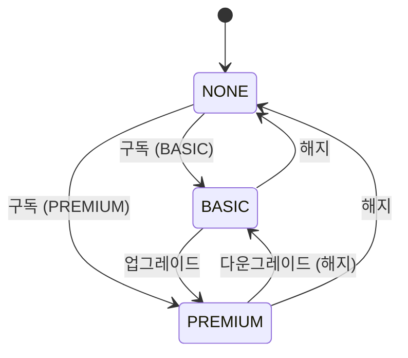
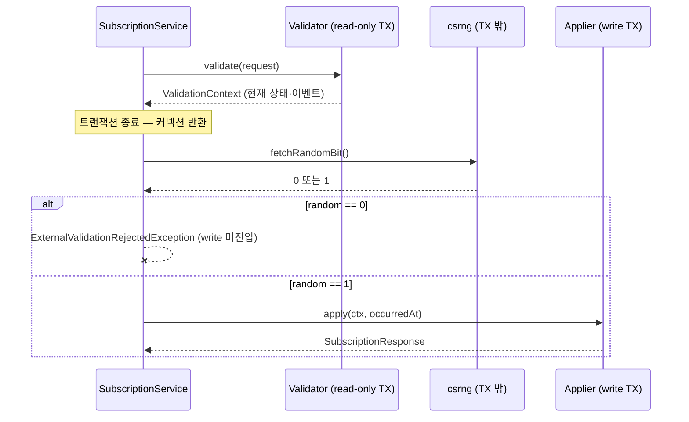
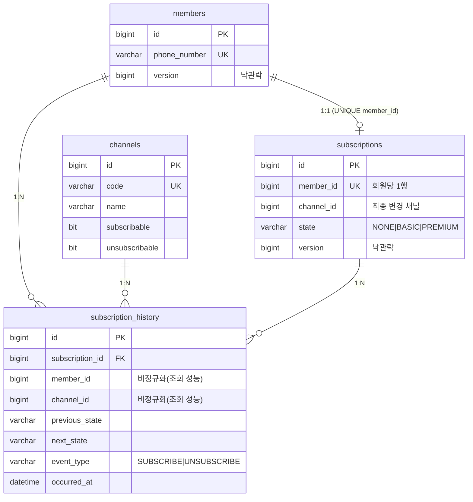

# 01. 아키텍처 설계 & 프로젝트 구성

> 구독 서비스의 코드 레벨 아키텍처

---

## 1. 설계 원칙

| 원칙 | 적용 |
|---|---|
| 도메인 불변식을 스키마로 강제 | "회원은 1개 상태만" → `subscriptions` UNIQUE(member_id) |
| 외부 호출과 트랜잭션 분리 | 2-Phase TX — 외부 API 호출을 DB 트랜잭션 밖에서 수행 |
| 상태 전이 단일 진실 소스 | `StateTransitionPolicy` 한 곳에서 전이 매트릭스 관리 |
| 장애 격리 | 외부 API(csrng/Gemini)는 어댑터로 캡슐화 + Resilience4j |
| 응답 일관성 | 성공/실패 모두 `ApiResponse` 단일 래퍼 |

---

## 2. 패키지 구조

feature-sliced 구조. 각 feature 패키지가 자체 `domain`/`application`/`dto`/`persistence` 레이어를 가진다.

```
com.artinus.membership
├── subscription        # 구독/해지
│   ├── application     #   SubscriptionService(오케스트레이터) / Validator / Applier
│   ├── domain          #   Subscription, SubscriptionState, StateTransitionPolicy,
│   │                   #   StateTransitionEvent, SubscriptionStateLabel
│   ├── dto             #   SubscriptionRequest / SubscriptionResponse
│   ├── persistence     #   SubscriptionRepository
│   └── SubscriptionController
├── history             # 이력 조회 + LLM 요약
│   ├── application     #   HistoryService / HistoryReader
│   ├── domain          #   SubscriptionHistory
│   ├── dto             #   SubscriptionHistoryResponse
│   ├── persistence     #   SubscriptionHistoryRepository
│   └── SubscriptionHistoryController
├── member              # Member 엔티티 + Repository
├── channel             # Channel 엔티티 + Repository
├── csrng               # 외부 트랜잭션 검증 어댑터 (Resilience4j)
├── llm                 # Gemini 요약 어댑터 (PromptTemplate · ThinkingConfig)
└── common              # ErrorCode, ApiResponse, GlobalExceptionHandler, ClockConfig
```

레이어드 패키지(`controller`/`service`/`repository` 전역 분할) 대신 feature-sliced를 택한 이유: 한 기능을 수정할 때 변경 파일이 한 패키지에 모여 응집도가 높고, 도메인 경계가 패키지 경계와 일치합니다.

---

## 3. 도메인 모델 — 구독 상태 머신

### 3.1 상태와 전이

회원은 `NONE`(구독 안 함) / `BASIC`(일반 구독) / `PREMIUM`(프리미엄 구독) **중 단 하나**의 상태를 가집니다.



전이 매트릭스(`StateTransitionPolicy`):

| 현재 \ 이벤트 | SUBSCRIBE_BASIC | SUBSCRIBE_PREMIUM | UNSUBSCRIBE_BASIC | UNSUBSCRIBE_NONE |
|---|---|---|---|---|
| NONE | BASIC | PREMIUM | 거부 | 거부 |
| BASIC | 거부(동일) | PREMIUM | 거부 | NONE |
| PREMIUM | 거부 | 거부(동일) | BASIC | NONE |

`StateTransitionPolicy`는 `EnumMap` 기반 정적 테이블로, 전이 가능 여부와 다음 상태를 단일 소스에서 결정합니다.

### 3.2 회원 단일 상태 모델

> 이 결정의 배경은 [05-limitations.md](05-limitations.md) 회원 단일 상태 참고.

- `subscriptions` 테이블은 `UNIQUE(member_id)` — 회원당 정확히 1행
- 행 자체가 "현재 상태"이며, 변경 시 UPDATE
- `channel_id`는 "최종 상태 변경 채널"(추적용)
- 모든 전이는 `subscription_history`에 append-only로 기록 (채널·시점 포함)

채널은 상태 변경의 **창구**일 뿐이며, 상태는 채널과 무관하게 회원 단위로 일관됩니다. 즉 홈페이지로 가입한 회원을 콜센터로 해지할 수 있습니다.

---

## 4. 2-Phase 트랜잭션

외부 API(csrng) 응답에 따라 커밋/롤백해야 하는데, 외부 호출을 DB 트랜잭션 안에서 하면 느린 외부 응답이 커넥션을 점유합니다. 이를 피하려고 3단계로 분리합니다.



| 단계 | 빈 | 트랜잭션 | 책임 |
|---|---|---|---|
| 1. 검증 | `SubscriptionValidator` | read-only | 채널 권한 → 의도 추론 → 상태 전이 검증 |
| 2. 외부 호출 | `CsrngClient` | **없음** | 난수 1비트 (커넥션 미점유) |
| 3. 적용 | `SubscriptionApplier` | write | 상태 UPDATE + history INSERT |

`SubscriptionService`에는 `@Transactional`을 두지 않습니다. Validator/Applier를 **별도 빈**으로 분리해 Spring AOP 프록시가 정상 동작하도록 합니다(self-invocation 함정 회피). Applier는 Validator 통과 후에도 동시성으로 상태가 변했을 수 있어 도메인에서 한 번 더 재검증합니다.

---

## 5. DB 스키마



- **Flyway** V1 단일 마이그레이션 + 채널 6종 시드 (홈페이지/모바일앱/네이버/SKT/콜센터/이메일)
- **낙관적 락**(`@Version`) — `members`, `subscriptions`. 동시 가입/변경 충돌을 409로 변환
- **이력 비정규화** — `subscription_history`에 `member_id`/`channel_id`를 복제 저장하여 LLM 요약 조회 시 조인 비용 절감
- **상태는 VARCHAR + 애플리케이션 검증** — CHECK 제약 대신 enum 검증으로 스키마 진화 단순화

---

## 6. 응답 일관성

성공/실패 모두 `ApiResponse<T>` 래퍼로 통일:

```json
{ "success": true, "data": { ... }, "message": null, "code": "SUCCESS", "timestamp": "...", "errors": null }
```

오류 시 `code`에 ErrorCode가 담기고, 검증 실패는 `errors[]`에 필드별 상세가 추가됩니다. 전체 에러 매트릭스는 [02-api.md](02-api.md)를 참고하세요.
