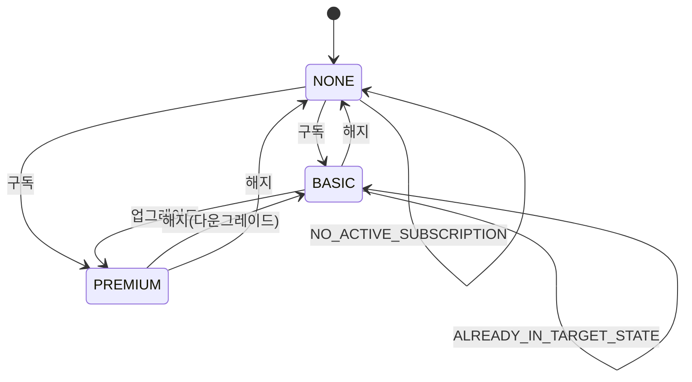

# 02. API 명세

> 엔드포인트 스키마는 Swagger UI(<http://localhost:8080/swagger-ui.html>)에서 인터랙티브하게 확인 가능.
> 
> 본 문서는 Swagger가 표현하기 어려운 **에러 매트릭스 · 상태 전이 · 검증/마스킹 규칙**을 보완합니다.

---

## 1. 엔드포인트

| Method | Path | 설명 |
|---|---|---|
| POST | `/api/v1/subscriptions` | 구독/해지 (요청 body의 `targetState`로 의도 분기) |
| GET | `/api/v1/members/{phoneNumber}/subscription-histories` | 최근 20건 이력 + LLM 요약 |

두 엔드포인트 모두 성공 시 **HTTP 200** + `ApiResponse` 래퍼로 응답합니다.

---

## 2. 공통 응답 래퍼 (`ApiResponse`)

```json
{
  "success": true,
  "data": { },
  "message": null,
  "code": "SUCCESS",
  "timestamp": "2026-05-25T00:21:49.879Z",
  "errors": null
}
```

| 필드 | 설명 |
|---|---|
| `success` | 처리 성공 여부 |
| `data` | 성공 페이로드 (오류 시 null) |
| `message` | 오류 메시지 (성공 시 null) |
| `code` | `SUCCESS` 또는 ErrorCode |
| `timestamp` | UTC ISO-8601 |
| `errors` | `@Valid` 필드별 오류 (VALIDATION_FAILED에만 포함) |

---

## 3. 구독/해지 API

### 요청

```json
POST /api/v1/subscriptions
{ "phoneNumber": "01012345678", "channelCode": "HOMEPAGE", "targetState": "BASIC" }
```

| 필드 | 검증 |
|---|---|
| `phoneNumber` | `^010\d{8}$` (11자리) |
| `channelCode` | HOMEPAGE / MOBILE_APP / NAVER / SKT / CALL_CENTER / EMAIL |
| `targetState` | NONE / BASIC / PREMIUM |

### 의도 추론

서버는 `(현재 상태, targetState)`로 구독/해지 의도를 추론합니다.

| 조건 | 의도 |
|---|---|
| `targetState == NONE` | UNSUBSCRIBE |
| `현재 == PREMIUM && targetState == BASIC` | UNSUBSCRIBE (부분 해지) |
| 그 외 | SUBSCRIBE |

### 채널 권한

| 채널 | 구독 | 해지 |
|---|---|---|
| 홈페이지(HOMEPAGE), 모바일앱(MOBILE_APP) | O | O |
| 네이버(NAVER), SKT | O | X |
| 콜센터(CALL_CENTER), 이메일(EMAIL) | X | O |

검증 순서: **채널 권한 → 동일 상태 차단 → 상태 전이 매트릭스**. 사용자가 받는 오류가 근본 원인과 일치하도록 채널 권한을 먼저 검사합니다.

---

## 4. 이력 조회 API

### 응답 (성공)

```json
{
  "success": true,
  "data": {
    "memberId": 1,
    "phoneNumber": "010-****-2222",
    "histories": [
      { "occurredAt": "...", "channelCode": "CALL_CENTER", "channelName": "콜센터",
        "previousState": "PREMIUM", "nextState": "NONE", "eventType": "UNSUBSCRIBE" }
    ],
    "summary": "고객은 ... 현재 구독 안 함 상태입니다.",
    "status": "NORMAL",
    "retrievedAt": "..."
  },
  "code": "SUCCESS"
}
```

### LLM 요약 상태 (`status`)

| 상황 | HTTP | `status` | `summary` | 비고 |
|---|---|---|---|---|
| 이력 ≥1 + LLM 성공 | 200 | `NORMAL` | 자연어 요약 | 정상 |
| 이력 ≥1 + LLM 실패 | 200 | `DEGRADED` | `null` | api-key 미설정/4xx/5xx/timeout 모두 동일 |
| 이력 0건 | 200 | `EMPTY` | `null` | LLM 호출 자체 생략 |

LLM 실패가 사용자 응답을 막지 않습니다(이력은 항상 반환). 근거는 [03-resilience.md](03-resilience.md)를 참고하세요.

### 마스킹

`phoneNumber`는 `010-****-2222` 형태로 가운데 4자리를 마스킹하여 응답합니다. LLM 프롬프트에는 전화번호를 **아예 포함하지 않습니다**(PII 보호).

---

## 5. 에러 코드 매트릭스

| ErrorCode | HTTP | 발생 상황 | 메시지(예) |
|---|---|---|---|
| `VALIDATION_FAILED` | 400 | `@Valid` 위반 (phoneNumber 형식 등) | 요청 본문 검증에 실패했습니다. + `errors[]` |
| `RESOURCE_NOT_FOUND` | 404 | 회원/채널 미존재 | Member not found: ... |
| `ALREADY_IN_TARGET_STATE` | 422 | 현재 상태와 동일한 상태 요청 | 이미 일반 구독 상태입니다. |
| `NO_ACTIVE_SUBSCRIPTION` | 422 | 구독 안 함 상태에서 해지 시도 | 구독 중이 아니므로 해지할 수 없습니다. |
| `DOWNGRADE_NOT_ALLOWED` | 422 | (방어) 허용되지 않은 다운그레이드 | 프리미엄 구독은 ... 해지 API를 이용해 주세요. |
| `INVALID_STATE_TRANSITION` | 422 | (방어) 매트릭스에 없는 전이 | 허용되지 않은 상태 전이입니다. |
| `EXTERNAL_VALIDATION_REJECTED` | 422 | csrng `random=0` | 외부 검증에 의해 거부되었습니다. |
| `CHANNEL_POLICY_VIOLATION` | 422 | 채널이 해당 액션 미지원 | 네이버 채널에서는 구독 해지를 할 수 없습니다. |
| `CONCURRENT_MODIFICATION` | 409 | 낙관락/UNIQUE 충돌 | 동시 수정 충돌이 발생했습니다. + `Retry-After: 1` |
| `EXTERNAL_API_UNAVAILABLE` | 502 | csrng 5xx/timeout/CB Open | 외부 API가 일시적으로 사용 불가합니다. |
| `INTERNAL_ERROR` | 500 | 미분류 오류 | 서버 내부 오류가 발생했습니다. |

> HTTP 상태 설계 의도: **400은 "요청을 못 읽음"**, **422는 "요청은 정상이나 도메인 규칙상 거부"**로 구분합니다. 4xx 비율을 모니터링할 때 입력 버그와 비즈니스 거부를 분리 추적할 수 있습니다.

---

## 6. 상태 전이 다이어그램



거부되는 전이는 모두 §5의 의미 있는 에러 코드로 매핑됩니다.
