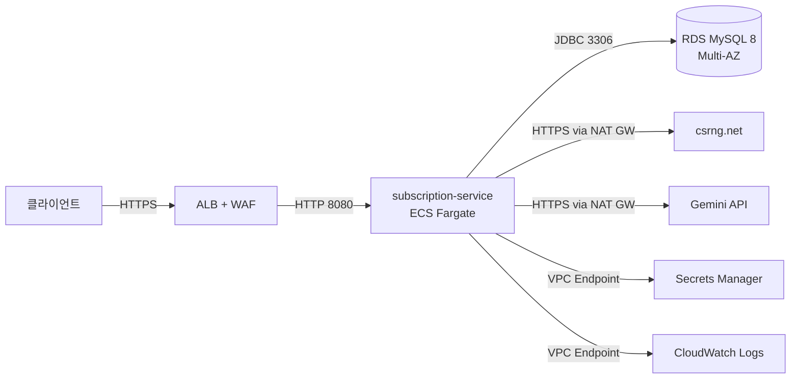
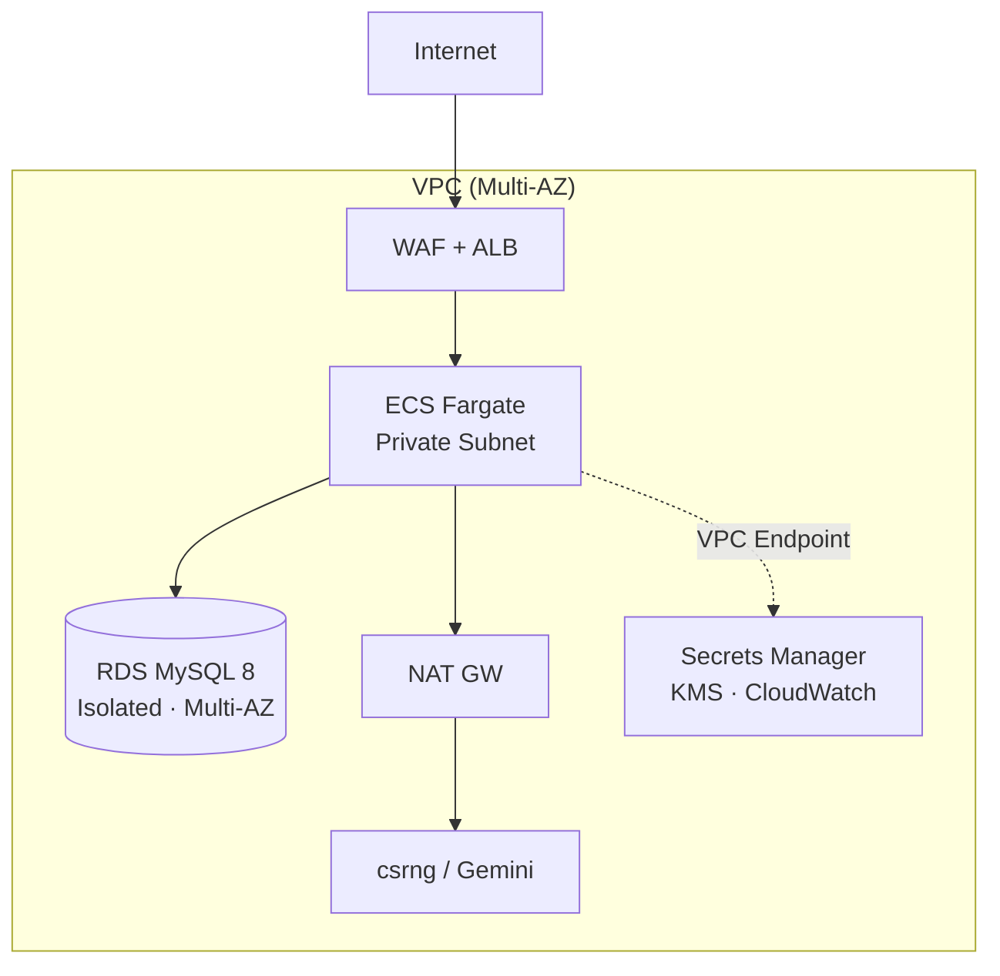
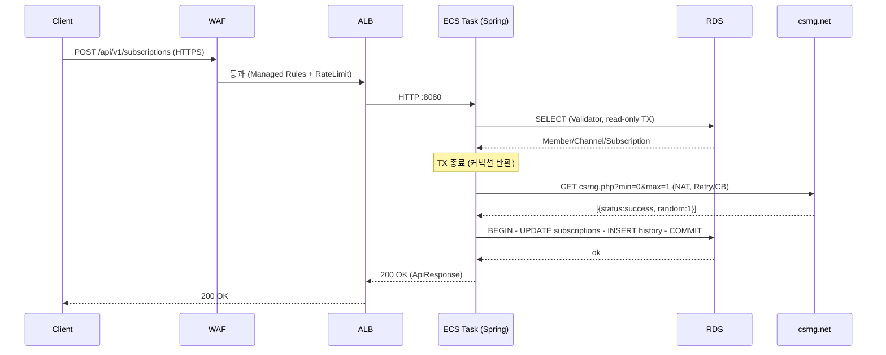

# 04. 클라우드 인프라 설계

> 본 서비스를 AWS 환경에 배포·운영한다는 가정의 설계 문서입니다. Terraform/CloudFormation 코드는 포함하지 않고 설계 의도를 우선 기록합니다.
> Region 가정: `ap-northeast-2`(서울) 단일 리전. 의도적으로 미적용한 항목은 [05-limitations.md](05-limitations.md)를 참고하세요.

---

## 1. 시스템 개요

회원의 휴대폰 번호를 키로 구독/해지 상태를 관리하고, 이력에 대한 LLM 요약을 제공합니다. 핵심 가치는 **채널 권한 + 상태 머신 결합 검증**, **외부 트랜잭션 검증 API(csrng) 장애 격리**, **LLM 자연어 요약**입니다.

운영상 가장 큰 위험은 동시 가입 경합과 외부 API 장애입니다. 따라서 컴퓨트는 stateless Fargate, 상태는 Multi-AZ RDS, 외부 호출은 NAT GW 경유 + Resilience4j로 격리합니다.

---

## 2. 시스템 컨텍스트

| 외부 시스템 | 책임 | 신뢰 수준 |
|---|---|---|
| csrng.net | 트랜잭션 커밋/롤백 결정 (난수) | 낮음 |
| Gemini API | 이력 자연어 요약 (선택적) | 낮음 |
| Secrets Manager | DB 비밀번호 / GEMINI_API_KEY | 높음(IAM) |
| CloudWatch | 로그 / 메트릭 / 알람 | 높음(IAM) |

---

## 3. 배포 토폴로지

2개 AZ(a, c)에 동일 구성을 대칭 배치합니다. 아래는 한 AZ 기준의 계층 구조입니다.

| 서브넷 | 자원 | 인터넷 |
|---|---|---|
| Public | ALB, NAT GW | 인입(ALB) / 아웃바운드(NAT) |
| Private | ECS Fargate Task | NAT 경유만 |
| Isolated | RDS Primary + Standby | 차단 |

외부 인터넷 호출(csrng, Gemini)만 NAT GW를 경유합니다. Secrets Manager / KMS / CloudWatch Logs는 VPC Endpoint로 우회해 NAT 비용과 외부 노출을 동시에 줄입니다.

---

## 4. 핵심 컴포넌트 선택

| 컴포넌트 | 선택 | 사유                                                                |
|---|---|-------------------------------------------------------------------|
| Compute | ECS Fargate | 노드 관리 회피, 자동 스케일링. EKS는 오버스펙이라 판단.                                |
| Database | RDS MySQL 8 Multi-AZ | 자동 failover, 자동 백업/PITR, KMS 통합. Aurora는 단일 라이터 워크로드에 비용 대비 이점 미비 |
| Load Balancer | ALB | L7, WAF 통합, ACM TLS termination                                   |
| WAF | AWS WAF v2 + Managed Rules | OWASP Top 10, IP rate limit                                       |
| Secrets | AWS Secrets Manager | KMS 암호화, 자동 로테이션, ECS Task 환경변수 주입                                |
| Observability | CloudWatch Logs + Metrics | Spring Actuator → Micrometer → CloudWatch 표준 경로                   |
| Encryption | KMS (Customer Managed CMK) | RDS at-rest, Secrets, Logs 모두 동일 CMK                              |
| TLS Cert | ACM | ALB 자동 갱신                                                         |
| Container Reg. | ECR | ECS와 동일 IAM/VPC 연계, VPC Endpoint로 NAT 비용 절감                       |

> MySQL 선택의 의사결정 배경(운영 익숙도)은 [06-ai-engineering.md](06-ai-engineering.md)를 참고하세요.

---

## 5. 네트워킹 / 보안

- **Security Group 체인** (최소 권한):
  - `sg-alb` ← Internet `:443` (HTTPS만)
  - `sg-ecs` ← `sg-alb` `:8080` (ALB만 인입)
  - `sg-rds` ← `sg-ecs` `:3306` (ECS만 인입)
- **IAM Task Role** — Secrets Manager에서 `DB_PASSWORD`/`GEMINI_API_KEY`만 read. 그 외 권한 없음
- **VPC Flow Logs** — VPC 단위 활성, 90일 보관
- **WAF Managed Rules** — `CommonRuleSet`(OWASP), `KnownBadInputs`, `RateBasedRule`(IP 100 req/5min)
- **TLS** — ALB에서 ACM termination. ALB → ECS는 VPC 내부 HTTP(8080), 외부 비노출
- **Secrets** — API key/DB 비밀번호는 git/task definition에 하드코딩 금지. Secrets Manager ARN 참조만 두고 부팅 시 주입

---

## 6. 가용성 / 복구

| 지표 | 목표 | 근거 |
|---|---|---|
| 가용성 SLA | 99.5% | 일반 SaaS 거래 목표 |
| **RPO** | **5분** | RDS automated backup + binlog PITR |
| **RTO** | **1시간** | Multi-AZ failover < 2분 + ECS auto-restart + ALB 재등록 |
| 백업 보관 | 7일 | 운영비용 균형 (장기 필요 시 S3 export) |
| Multi-AZ Failover | 자동 | Primary 장애 시 30~60초 내 Standby promote |

ECS Service `desired-count >= 2`(AZ 분산)로 단일 Task 장애에 즉시 복구합니다. 외부 API 장애는 Resilience4j로 흡수하므로 RPO/RTO 산정에서 제외합니다(소비자는 502 또는 status=DEGRADED로 즉시 인지).

---

## 7. 비용 최적화

- **Fargate Spot** — 개발/스테이징 80% Spot, 운영은 On-Demand
- **RDS Reserved Instance** — 운영 1년 RI로 약 30% 절감
- **NAT GW 우회** — Secrets/KMS/Logs/ECR Pull은 VPC Endpoint. csrng/Gemini만 NAT 경유
- **CloudWatch Logs Retention** — 30일 + S3 Glacier archive
- **이미지** — multi-stage Dockerfile로 슬림 이미지, ECR 저장 비용 절감

---

## 8. 트래픽 흐름 — 구독 요청 (Happy Path)

장애 경로:
- csrng 5xx/timeout/CB Open → 외부 호출 단계에서 502 반환, write TX 미진입
- csrng `random=0` → 422 EXTERNAL_VALIDATION_REJECTED, write TX 미진입
- 낙관락 충돌 → 409 CONCURRENT_MODIFICATION + `Retry-After: 1`

---

## 9. 운영 보강 후보 (미적용)

운영 시 가성비 좋은 추가 작업 — 본 과제 범위 밖이나 인지하고 있음을 기록합니다.

- **이력 요약 캐싱** (Caffeine → ElastiCache) — [05-limitations.md](05-limitations.md) 참고
- **AWS X-Ray** — csrng/Gemini latency 분포 추적
- **ECS 자동 스케일링** — CPU 60% / Mem 70% target tracking
- **Blue/Green 배포** — CodeDeploy + ALB 이중 target group
- **DLQ** — csrng 실패 재처리 (SQS DLQ + Lambda re-driver)
- **LLM 비용 모니터링** — Gemini 호출 수/토큰 일일 집계 + SNS 알람
- **CircuitBreaker open 메트릭 → CloudWatch 알람** (Resilience4j Micrometer)
- **5xx rate / p99 latency 알람** (Composite Alarm)
- **Bastion / SSM Session Manager** — Private subnet 진입 (SSH key 미사용)

---

## 10. 메타

- **연계 코드 경로**
  - 외부 API 어댑터: `com.artinus.membership.csrng.CsrngClient`, `com.artinus.membership.llm.GeminiClient`
  - 트랜잭션 경계: `com.artinus.membership.subscription.application.{SubscriptionService, SubscriptionValidator, SubscriptionApplier}`
  - 응답 통일: `com.artinus.membership.common.exception.GlobalExceptionHandler`
- **Region 가정**: ap-northeast-2 (서울). KMS CMK는 region-scoped
- **런타임**: Java 21 + Spring Boot 3.3.x
