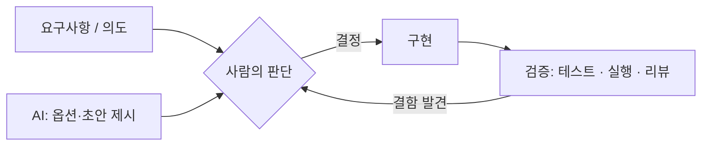

# 06. AI 협업 엔지니어링

> 본 과제는 AI 코딩 도구를 적극 활용해 작성했습니다. 이 문서는 **AI를 어떻게 도구로 다뤘는가** — 무엇을 위임하고, 무엇을 사람이 결정했으며, AI 산출물을 어떻게 검증했는가를 투명하게 기록합니다.

---

## 1. 원칙

AI는 강력한 제안자이지만, 도메인 요구사항 해석과 기술 트레이드오프의 **최종 판단은 사람의 책임**으로 두었습니다. AI 산출물은 항상 "검증 대상"이지 "정답"이 아닙니다.

---

## 2. 사용 도구

| 도구 | 역할 |
|---|---|
| Claude Code (Opus 4.7) | 코드 작성, 리팩토링, 문서화, 테스트 작성 |
| oh-my-claudecode (멀티 에이전트) | 탐색·계획·구현·리뷰 단계별 에이전트 오케스트레이션 |
| Testcontainers / Docker | AI 산출물의 실제 동작 검증 (실행 기반) |

---

## 3. AI 제안 vs 사람 결정

| 사안 | AI 제안 | 사람의 결정 | 결정 근거 |
|---|---|---|---|
| **데이터베이스** | PostgreSQL / MySQL 등 옵션 제시 | **MySQL 8.0** 선택 | 운영·트러블슈팅 익숙도. 본 워크로드(단일 라이터)에 충분 |
| **LLM 캐싱** | Caffeine/Redis 캐시 적용 제안 | **미적용 + 문서화**로 결정 | 과제 핵심과 직교하는 최적화. 잘못 적용 시 버그 위험 → [05-limitations.md](05-limitations.md)에 설계만 기록 |
| **HTTP 상태 설계** | 422를 400으로 축약 옵션 제시 | **422 유지** | "요청 못 읽음(400)" vs "도메인 거부(422)" 모니터링 분리 이점 |
| **회원 상태 모델** | (초기) 채널별 복합 키 구현 | **회원 단일 상태로 수정** | ASSIGNMENT 요구·예시와 충돌 발견 (§5) |
| **에러 메시지** | 영문 기술 메시지 | **한글 의미 메시지로 전환** | 실제 사용자가 원인을 즉시 이해하도록 |

---

## 4. AI에 위임한 작업

반복적이거나 기계적인 작업은 적극 위임해 생산성을 높였습니다.

- 보일러플레이트 (엔티티, DTO, Repository, 예외 클래스)
- 테스트 케이스 작성 (단위·슬라이스·통합)
- 리팩토링 (변수명 일괄 변경, import 정리)
- 문서 초안 (본 docs 세트 포함)
- 외부 API 디버깅 (Gemini 404 원인 추적, thinking 토큰 잠식 분석)

위임하되, 결과물은 **항상 테스트·실행으로 검증**했습니다.

---

## 5. AI 산출물 검증 사례

AI 산출물을 맹신하지 않고 검증한 실제 사례들입니다.

### 5.1 회원 단일 상태 모델 결함 (가장 중요)

AI가 초기에 생성한 스키마는 `UNIQUE(member_id, channel_id)`로, 회원이 채널별로 독립된 구독 상태를 갖는 구조였습니다. 코드와 테스트는 모두 통과했지만, **실제 앱을 띄워 ASSIGNMENT 예시 시나리오를 직접 호출**하니 "홈페이지 가입 → 콜센터 해지"가 거부되는 것을 발견했습니다.

- 사람이 ASSIGNMENT 요구("회원은 1개 상태만")와 대조해 결함으로 판정했습니다.
- 단일 상태 모델로 수정 결정 → AI에 구현 위임 → 통합 테스트로 재검증했습니다.
- 교훈: **테스트 통과 ≠ 요구사항 충족.** 실행 기반 검증이 결함을 잡았습니다.

### 5.2 LLM 모델 deprecated (gemini-2.0-flash 404)

실제 호출에서 404가 떴고, AI와 함께 원인을 추적해 "신규 사용자에게 미제공 모델"임을 확인했습니다. 이후 `gemini-2.5-flash`로 교체했습니다.

### 5.3 thinking 토큰이 출력을 잠식

2.5-flash 전환 후 요약이 중간에 잘렸습니다. API를 직접 호출해 `finishReason=MAX_TOKENS`, thinking 284토큰 소비를 확인하고 `thinkingBudget=0`으로 해결했습니다. 단순히 AI 코드를 믿지 않고 **외부 API 응답을 직접 관찰**해 근본 원인을 잡았습니다.

---

## 6. 프롬프트 엔지니어링 (LLM 요약 기능)

본 서비스의 Gemini 요약 프롬프트(`PromptTemplate`) 자체도 신중히 설계했습니다.

| 설계 | 의도 |
|---|---|
| 시스템 지시문 하드코딩 | prompt injection 방어 (사용자 입력이 시스템 역할로 섞이지 않음) |
| PII 미포함 | 전화번호·memberId를 프롬프트에 넣지 않음 |
| 채널/상태를 한글 라벨로 입력 치환 | 모델이 영문 enum을 추측·환각하는 것을 방지 |
| ASC 정렬 + "현재 상태 명시" 지시 | 시계열 흐름 + ASSIGNMENT 예시와 동일한 마무리 |
| `thinkingBudget=0` + `maxOutputTokens=512` | 비용·지연 상한 |

이 설계의 효과는 출력 비교로 검증했습니다:
- Before: `홈페이지에서 BASIC 구독 후 모바일 앱에서 PREMIUM으로 변경`
- After: `홈페이지를 통해 일반 구독을 시작 ... 콜센터를 통해 구독을 취소하여 현재 구독 안 함 상태입니다`

---

## 7. 결론

AI는 구현 속도를 크게 높였지만, 본 과제의 **핵심 판단(도메인 모델, 기술 선택, 트레이드오프)은 사람이 내렸습니다.** 특히 회원 단일 상태 모델 결함처럼 AI 산출물의 결함을 실행 기반 검증으로 잡아낸 것이 품질의 핵심이었습니다. AI를 "검증 대상을 빠르게 만들어 주는 도구"로 다루고, 사람이 요구사항과 대조하며 책임지는 협업 방식을 지향했습니다.
