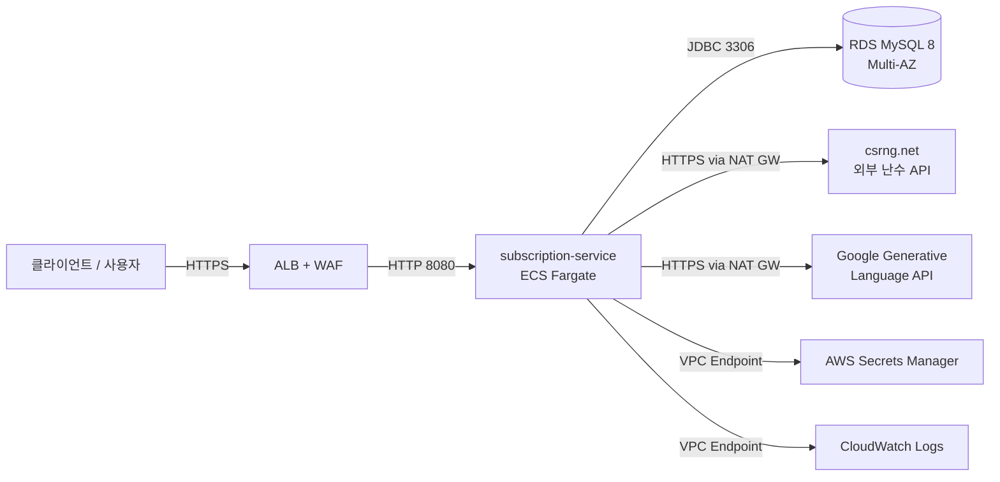
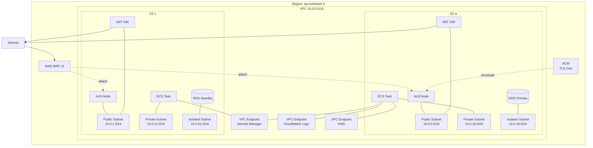

# 클라우드 아키텍처 — ARTINUS 구독 서비스

> 작성 기준: Phase 5 (2026-05-20).
> 본 문서는 본 서비스를 AWS 환경에 배포·운영한다는 가정의 설계 문서다.
> Terraform/CloudFormation 코드는 포함하지 않는다(설계 의도를 우선 기록한다).

---

## 1. 시스템 개요

ARTINUS 구독 서비스는 회원의 휴대폰 번호를 키로 다채널 구독/해지 상태를 관리하고, 구독 이력에 대한 LLM 요약을 제공한다. 핵심 비즈니스 가치는 **채널 권한 + 상태 머신 결합 검증**, **외부 트랜잭션 검증 API(csrng) 장애 격리**, **LLM 자연어 요약**의 세 가지로 압축된다.

운영 측면에서는 동시 가입 경합과 외부 API 장애가 가장 큰 위험이므로, 컴퓨트는 stateless Fargate 컨테이너, 상태는 Multi-AZ RDS, 외부 API 호출은 NAT GW 경유 + Resilience4j Retry/CircuitBreaker로 격리한다. 본 문서는 Region `ap-northeast-2`(서울) 단일 리전 배포를 가정한다.

---

## 2. 시스템 컨텍스트



| 외부 시스템   | 책임                           | 신뢰 수준 |
| ------------- | ------------------------------ | --------- |
| csrng.net     | 트랜잭션 커밋/롤백 결정 (난수) | 낮음      |
| Gemini API    | 이력 자연어 요약 (선택적)      | 낮음      |
| Secrets Mgr   | DB 비밀번호 / GEMINI_API_KEY   | 높음(IAM) |
| CloudWatch    | 로그 / 메트릭 / 알람           | 높음(IAM) |

---

## 3. 컨테이너 / 배포 토폴로지



| 서브넷 유형 | 위치              | 자원                                        |
| ----------- | ----------------- | ------------------------------------------- |
| Public      | AZ a, c           | ALB 노드, NAT GW (AZ당 1개)                 |
| Private     | AZ a, c           | ECS Fargate Task (subscription-service)     |
| Isolated    | AZ a, c           | RDS MySQL 8 Primary + Standby (Multi-AZ)    |

외부 인터넷 호출(csrng, Gemini)은 ECS Task → NAT GW → IGW 경로를 거친다. Secrets Manager / KMS / CloudWatch Logs는 VPC Endpoint를 사용하여 NAT GW 비용과 외부 노출을 동시에 줄인다.

---

## 4. 핵심 컴포넌트 선택

| 컴포넌트       | 선택                        | 사유                                                                                          |
| -------------- | --------------------------- | --------------------------------------------------------------------------------------------- |
| Compute        | ECS Fargate                 | 컨테이너 단순 운영, 노드 관리 회피, 자동 스케일링. EKS는 본 규모에 오버 스펙               |
| Database       | RDS MySQL 8 Multi-AZ        | 자동 failover, 자동 백업/PITR, KMS 통합. Aurora는 비용 대비 이점 미비 (단일 라이터 워크로드) |
| Load Balancer  | Application Load Balancer   | L7, ProblemDetail JSON 직접 라우팅, WAF 통합, ACM TLS termination                              |
| WAF            | AWS WAF v2 + Managed Rules  | OWASP Top 10, IP rate limit. SaaS WAF 대비 통합/비용 우수                                    |
| Secrets        | AWS Secrets Manager         | KMS 암호화, 자동 로테이션 가능, ECS Task에 환경변수 주입                                     |
| Observability  | CloudWatch Logs + Metrics   | Spring Boot Actuator → Micrometer → CloudWatch 표준 경로. Prometheus/Grafana는 도입 안 함     |
| Encryption     | KMS (Customer Managed CMK)  | RDS at-rest, Secrets, CloudWatch Logs 모두 동일 CMK로 envelope encryption                    |
| TLS Cert       | ACM                         | ALB 자동 갱신, 별도 CA 미사용                                                                |
| Container Reg. | ECR                         | ECS와 동일 IAM/VPC 연계, ECR Pull용 VPC Endpoint로 NAT 비용 절감                              |

본 과제 범위 밖이지만 운영에 필요한 보조 서비스(Bastion/Jump Host, CodePipeline 등)는 §8에서 별도로 다룬다.

---

## 5. 네트워킹 / 보안

- **Security Group 체인** (최소 권한):
  - `sg-alb` ← Internet `:443` (HTTPS만)
  - `sg-ecs` ← `sg-alb` `:8080` (HTTP, ALB만 인입 허용)
  - `sg-rds` ← `sg-ecs` `:3306` (DB, ECS만 인입 허용)
- **IAM Task Role** — ECS Task가 Secrets Manager에서 `DB_PASSWORD` / `GEMINI_API_KEY`만 read 가능. S3/EC2/IAM 다른 권한 일체 없음.
- **VPC Flow Logs** — VPC 단위 활성, CloudWatch Logs에 90일 보관. 의심 트래픽 추적용.
- **AWS WAF v2 Managed Rules**:
  - `AWSManagedRulesCommonRuleSet` — OWASP Top 10
  - `AWSManagedRulesKnownBadInputsRuleSet`
  - `RateBasedRule` — IP 단위 100 req/5min 임계.
- **TLS** — ALB에서 ACM 인증서로 termination. ALB → ECS는 VPC 내 HTTP(8080)이며 VPC 외부에 노출되지 않음.
- **Secrets** — `GEMINI_API_KEY`와 `DB_PASSWORD`는 git/ECS task definition에 하드코딩 금지. Secrets Manager 참조 ARN만 task definition에 두고 ECS 부팅 시 환경변수로 주입.

---

## 6. 가용성 / 복구

| 지표                     | 목표           | 근거                                                                                |
| ------------------------ | -------------- | ----------------------------------------------------------------------------------- |
| 가용성 SLA               | 99.5%          | 본 과제 핵심 거래(구독/해지) 일반 SaaS 목표                                       |
| **RPO** (데이터 손실)    | **5분**        | RDS automated backup 5분 단위 binlog point-in-time recovery 활용                   |
| **RTO** (서비스 복구)    | **1시간**      | RDS Multi-AZ failover < 2분 + ECS Service auto-restart + ALB target re-registration |
| 백업 보관 기간           | 7일            | 운영비용 균형. 장기 보관 필요 시 S3 export로 별도                                  |
| Multi-AZ Failover        | 자동           | Primary 장애 시 Standby로 30~60초 내 자동 promote                                  |

ECS Service `desired-count >= 2` (AZ 분산)으로 단일 Task 장애에 즉시 복구. 외부 API 장애는 Resilience4j Retry + CircuitBreaker로 흡수하며 RPO/RTO 산정에 포함하지 않는다(소비자 측은 502 또는 status=DEGRADED 응답으로 즉시 인지).

---

## 7. 비용 최적화

- **Fargate Spot** — 개발/스테이징 환경 80% Spot 사용. 운영은 On-Demand.
- **RDS Reserved Instance** — 운영 1년 RI로 약 30% 절감.
- **NAT GW 비용 우회** — Secrets Manager / KMS / CloudWatch Logs / ECR Pull은 VPC Endpoint로 우회. csrng/Gemini만 NAT 경유.
- **CloudWatch Logs Retention** — 30일 보관 + S3 Glacier로 archive (필요 시).
- **이미지 빌드** — multi-stage Dockerfile + Distroless 베이스로 이미지 < 200MB, ECR 저장 비용 절감.

---

## 8. 한계점 & 트레이드오프 (면접 방어 포인트)

### 8.1 의도적으로 미적용한 것

| 미적용 항목                | 사유                                                                                              |
| -------------------------- | ------------------------------------------------------------------------------------------------- |
| Redis 캐시                 | 이력 조회 빈도 낮음. 캐시 무효화 복잡도 대비 이득 낮음. RDS read replica로 충분히 대체 가능       |
| Kafka / 이벤트 소싱        | 외부 이벤트 통합 요구 없음. `subscription_history` append-only로 도메인 이벤트 흔적 보존됨       |
| 마이크로서비스 분리         | 단일 도메인. 모놀리스가 통신 비용/배포 복잡도 측면에서 우월                                       |
| GraphQL                    | 단순 REST 3개 엔드포인트로 충분. GraphQL은 N+1 / 인증 복잡도 추가                                 |
| Multi-Region (DR)          | RPO/RTO 목표가 일반 SLA 수준이라 cross-region replica 비용 대비 이득 미비                          |
| AWS Lambda (서버리스)      | 외부 API 호출 latency가 길어 cold start와 결합 시 사용자 경험 저하. Fargate가 더 적합            |
| CloudFront / Route53 geo   | 정적 자산 없음, 단일 리전이므로 사용처 미존재                                                     |
| API Gateway                | ALB로 충분. API Gateway는 비용/복잡도 대비 본 과제에서 추가 가치 없음                              |
| Step Functions             | 트랜잭션 흐름이 2-Phase로 단순. 워크플로우 엔진 미요구                                              |

### 8.2 운영 시 보강 필요 (가성비 좋은 추가 작업 후보)

- **AWS X-Ray** — csrng/Gemini 외부 호출 latency 분포 추적. p99 spike 원인 분석에 필수.
- **ECS 자동 스케일링 정책** — CPU 60% / 메모리 70% 임계, target tracking.
- **Blue/Green 배포** — AWS CodeDeploy + ECS를 통해 무중단 배포. ALB target group 두 개 운영.
- **DLQ (Dead Letter Queue)** — csrng 호출 실패의 재처리 흐름 (현재 단순 502). SQS DLQ + Lambda re-driver.
- **LLM 비용 모니터링** — Gemini 호출 수/응답 토큰 일일 집계, 임계 초과 시 SNS 알람. 비용 폭주 방지.
- **CircuitBreaker open metric → CloudWatch 알람** — Resilience4j Micrometer publisher 활용.
- **5xx rate / latency p99 알람** — CloudWatch Composite Alarm.
- **Bastion / SSM Session Manager** — Private subnet 진입 경로 (port forward로 RDS 접근, SSH key 사용 안 함).

---

## 9. 트래픽 흐름 — 구독 요청 예시 (Happy Path)

```mermaid
sequenceDiagram
    participant C as Client
    participant W as WAF
    participant L as ALB
    participant A as ECS Task (Spring)
    participant D as RDS
    participant X as csrng.net

    C->>W: POST /api/v1/subscriptions (HTTPS)
    W->>L: 통과 (Managed Rules + RateLimit)
    L->>A: HTTP :8080
    A->>D: SELECT (Validator, read-only TX)
    D-->>A: Member/Channel/Subscription 행
    Note over A: TX 종료
    A->>X: GET /csrng/csrng.php?min=0&max=1 (NAT 경유, Retry/CB)
    X-->>A: [{status:success, random:1}]
    A->>D: BEGIN; UPDATE subscriptions; INSERT subscription_history; COMMIT
    D-->>A: ok
    A-->>L: 201 Created
    L-->>C: 201 Created
```

장애 경로:
- csrng 5xx/timeout/CB Open → 본 흐름의 두 번째 외부 호출 단계에서 502 반환, write TX 미진입.
- csrng `random=0` → 422 EXTERNAL_VALIDATION_REJECTED 반환, write TX 미진입.
- 낙관락 충돌 → 409 CONCURRENT_MODIFICATION + `Retry-After: 1`.

---

## 10. 메타

- **본 설계 문서의 SoT**: `.omc/reviews/2026-05-19-phase0-handoff.md` §3.8 (AWS 누락 항목 리스트) + §3.2 (HTTP 상태 매트릭스).
- **연계 코드 경로**:
  - 외부 API 어댑터: `com.artinus.subscription.external.csrng.CsrngClient`, `com.artinus.subscription.external.llm.GeminiClient`
  - 트랜잭션 경계: `com.artinus.subscription.application.{SubscriptionService, SubscriptionValidator, SubscriptionApplier}`
  - 응답 통일: `com.artinus.subscription.presentation.GlobalExceptionHandler`
- **Region 가정**: ap-northeast-2 (서울). KMS CMK는 region-scoped.
- **언어/런타임 가정**: Java 21 + Spring Boot 3.3.x. Virtual Thread 활성화는 운영 결정에 따름(현재 application.yml은 기본값).
